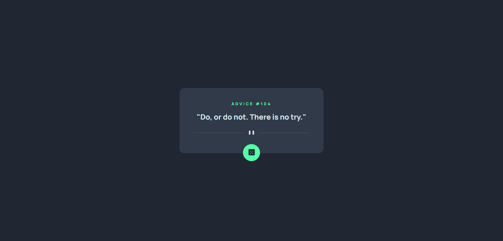

# Frontend Mentor - Advice generator app solution

This is a solution to the [Advice generator app challenge on Frontend Mentor](https://www.frontendmentor.io/challenges/advice-generator-app-QdUG-13db)

### The challenge

Make use of the [Advice Slip API](https://api.adviceslip.com/) to generator a piece of advice. The use clicks on the buttons and random piece of advice and its ID number are displayed. The page is fully responsive.
